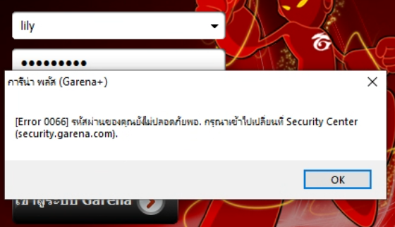

# open-talktalk
[](#) [](https://discord.gg/T5MF85vX5r) [](#)

basically i'm reverse engineering the [TalkTalk client](https://web.archive.org/web/20160319124007/http://cdn.th.garenanow.com/talktalk/installer/TalkTalk_FullInstall_th.exe) (2016-03-19), figuring out how it talked to
the servers, and building a new server + a patcher so the client connects to it
instead. the original servers are long gone so we make our own.

## why???
good question, i'm reviving it because it was a part of my childhood (2014-2017) when it was commonly used by minecraft servers at the time.
i met a lot of people there and it was an experience that i do not want to forget.

## current stage of open-talktalk

the client talks to my server now.

i redirected the dead server `live.imconnect.garenanow.com` to my own server. (hosts file + a python socket server).

captured the login packets and i already made it pop up any error the client has `0x21`, `0x66`, etc


a good chunk of the docs is me guessing stuff - see [docs/PROTOCOL.md](docs/PROTOCOL.md)
if something's wrong feel free to send a pull request.

- [x] make client connect to my own server
- [x] cracked the TCP framing + pre-login packet (confirmed from live traffic)
- [x] make the client show error messages sent from my server
- [x] reversed the crypto (XTEA-CBC, 1024-bit RSA key for the handshake)
- [ ] the pre-login reply/key exchange (so it sends the password)
- [ ] patcher (swap the client's RSA key for ours)
- [ ] actual working login
- [ ] then the fun stuff: chat, rooms, all that


## how it works (quick version)

the client send some GET request to HTTP(S) servers to retrieve config/version, then it open a **raw binary TCP connection** to `live.imconnect.garenanow.com:9100`.
that hostname has been dead so client can't connect to it
```bash
⬢ [mrrpmeowfurry@toolbx open-talktalk]$ ping live.imconnect.garenanow.com
ping: live.imconnect.garenanow.com: Name or service not known
```

so what i did was, i point that hostname to my own server (using hosts file), run `proxy-test.py` on port 9100
```bash
C:\Users\Lily>ping live.imconnect.garenanow.com

Pinging live.imconnect.garenanow.com [192.168.1.233] with 32 bytes of data:
Reply from 192.168.1.233: bytes=32 time=9ms TTL=64
Reply from 192.168.1.233: bytes=32 time=13ms TTL=64
Reply from 192.168.1.233: bytes=32 time=18ms TTL=64
Reply from 192.168.1.233: bytes=32 time=13ms TTL=64
```
and the client talk to *our* server. packets are framed as `[4-byte length][opcode][payload]`. login uses XTEA and an RSA key baked right into the .exe.

problem: the original server's private key is gone forever, so we can't just pretend to be garena.
so instead we **patch the client** to trust *our* RSA key, point it at *our* server, and rebuild the backend ourselves. but a surprising amount already works without that (see above).

if you want the actual technical breakdown it's all in [docs/PROTOCOL.md](docs/PROTOCOL.md).


## legal bit, to prevent me from getting DMCA'd or sued

this project does NOT use garena's keys or servers. we generate our own keys.
and this project does not use any leaked source code. purely reverse engineered
with Ghidra.


## license

[MIT](LICENSE)
